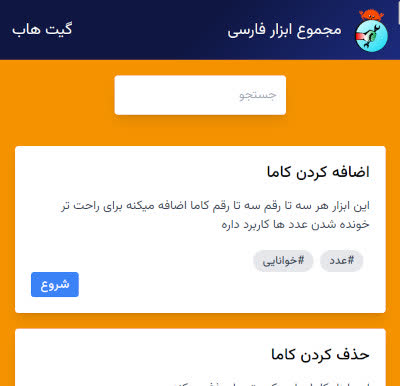
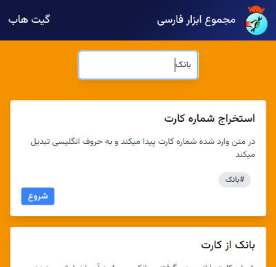
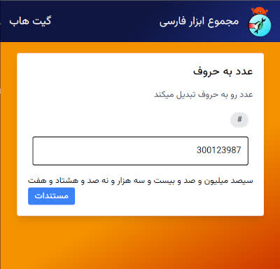

# Persian Tools Web

Web interface for [rust-persian-tools](https://github.com/persian-tools/rust-persian-tools) library.

[
Open Web App
](https://ali77gh.github.io/PersianToolsWeb/)

Powered by WASM and Dioxus and hosted on Github pages.

## Screenshots

</img>
</img>
</img>

## TODO

custom input for:\

1. "get_plate_type"\
1. "get_plate_province"\
1. "get_plate_category"\
1. "time_diff"\

add link to here from rust-persian-tools

SEO

Clippy

translate errors to persian (wrapper.rs)
